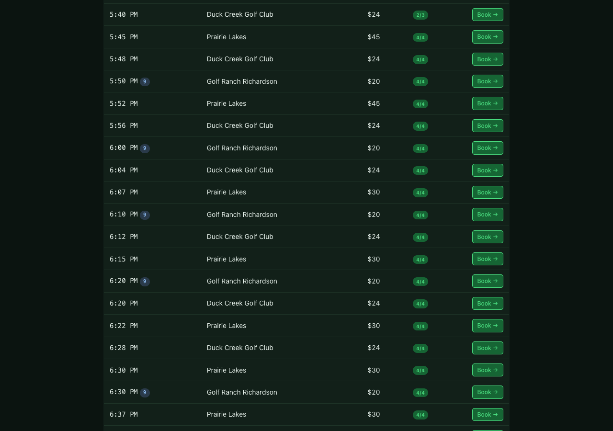

# ⛳ Dallas Open Tee Times

**Live:** https://tee-times.philipbernard.workers.dev

A web app that shows open tee times at 4 public golf courses in the Dallas
area — Irving Golf Club, Prairie Lakes, Golf Ranch Richardson, and
Duck Creek Golf Club. All within 15 miles of 75206 (Lower Greenville).

Built June 2026. This README documents the **look and feel that we want**
— the design language, data model, and architecture we should hold to
when extending this to other cities or vendors.



---

## Look and feel

### What this is

A focused, single-purpose tee-time browser. **One page, one decision:**
what's open at which course, when, and at what price. Filter chips up
top, results grouped by date, each row is one slot.

### Design language

- **Dark theme, low chroma.** Forest-green accent (`#4ade80`) on a
  near-black background. No gradients, no glassmorphism, no decorative
  imagery. The data is the design.
- **Compact rows.** Time / course / fee / open count / book button,
  one per row. Mobile widths collapse to 13px font, controls stack
  to 2-up grid. No horizontal scroll on a phone.
- **Status line lives between filters and results.** It tells you how
  fresh the data is (relative timestamp), how many slots are open,
  and silently logs fetch errors so they can be debugged without
  breaking the page.
- **"Book →" deep-links to the course's own booking engine.** We are
  not the booking system. We surface availability and get out of the
  way.
- **Course names inline, not logo-strip.** A logo strip says "look at
  our partners"; a list says "these are your options." We picked the
  latter.

### Typography

System font stack (`-apple-system, BlinkMacSystemFont, "SF Pro Text"`).
Section overlines in 11px uppercase 0.06em letter-spacing — same
treatment as the LMDW article strip. Time column uses `ui-monospace`
to make 8:00 line up next to 8:00 without the eye having to do
alignment work.

### What we deliberately did NOT do

- **No user accounts.** This is a single-user tool. Accounts add
  infrastructure without adding value at this scope.
- **No booking automation.** We surface slots. Booking requires
  cookies, payment, idempotency, and stuck-cart recovery — that's a
  different product. (See Roadmap.)
- **No driver directions, no weather, no course photos.** Other
  tools do this. The point of this one is "what's open *right now*."
- **No email digest signup form.** There is a cron that produces a
  digest to Discord (see `scripts/`); that's the only outbound
  channel.

---

## Architecture

```
┌─────────────────────────────────────────────────────────────┐
│ Cloudflare Workers (tee-times.philipbernard.workers.dev)     │
│                                                              │
│   ┌──────────────────┐      ┌──────────────────────────┐    │
│   │ Next.js 16 page  │ ───▶ │ /api/teetimes (Node.js)  │    │
│   │ (client filters) │      │ + ASSETS binding for /_next│   │
│   └──────────────────┘      └────────────┬─────────────┘    │
│                                          │                   │
└──────────────────────────────────────────┼───────────────────┘
                                           │
                                           ▼
                            ┌──────────────────────────────┐
                            │ phx-api-be-east-1b.kenna.io  │
                            │   /v2/tee-times              │
                            │   (Kenna, owned by GolfNow)  │
                            │                              │
                            │   Header required:           │
                            │   x-be-alias: <course-slug>  │
                            └──────────────────────────────┘
```

**Stack:**
- Next.js 16 (App Router) + React 19 + TypeScript
- OpenNext 1.19 on Cloudflare Workers (Node.js runtime)
- Tailwind-free, plain CSS with custom properties
- Data source: `phx-api-be-east-1b.kenna.io` (public, no auth)

**Why no Tailwind / shadcn / component library:** the page has exactly
one layout (filter grid + status line + tables). A utility-CSS framework
would be more weight than the actual styles. Plain CSS at 4.9KB covers
everything.

**Why Node.js runtime for the API route, not edge:** OpenNext 1.19
bundles edge runtime routes into a separate worker, which complicates
the build. The Kenna fetch works identically on Node runtime and we
get one worker per site.

---

## Adding a course

1. Open the course's TeeItUp booking page in a browser.
2. Capture the `facilityIds=NNNN` value from the `kenna.io/v2/tee-times`
   network request.
3. Add a `Course` entry to `site/lib/courses.ts`:

   ```ts
   {
     id: "my-course",                            // URL-safe
     name: "My Course",
     slug: "my-course-booking-slug",             // x-be-alias header
     facilityId: 12345,                          // from step 2
     bookingUrl: "https://my-course.book.teeitup.com/",
     holes: 18,                                  // 9 or 18, default if uniform
   }
   ```

4. Redeploy: `bash deploy.sh`

The new course appears in the dropdown and gets polled automatically.
No other code changes needed.

---

## Vendors we DON'T support yet (and why)

| Vendor | Courses | Status |
|---|---|---|
| **TeeItUp / Kenna** | Irving, Prairie Lakes, Golf Ranch, Duck Creek | ✅ Working — `x-be-alias` JSON API, no auth |
| **Purpose Golf** | Sherrill Park | ❌ Requires login + ASP.NET antiforgery token; needs a session-managed scraper. See `skills/web/teeitup-kenna-teetimes-api/SKILL.md` for notes. |
| **EZLinks Golf** (Arcis Dallas) | Cedar Crest, L.B. Houston, Stevens Park, Tenison, Lake Park, Brook Hollow | ❌ Cloudflare "Just a moment" challenge blocks headless scrapers. Need browser-vision to defeat, or a residential proxy. |
| **ForeUP** | (none in Dallas) | 🟡 Public booking API exists but is rate-limited and geo-fenced per course. Each site needs custom adapter. |
| **Chronogolf** | (none in Dallas) | 🟡 Has a public teetimes API but rate-limits aggressively. Same shape as ForeUP. |
| **TeeOff / GolfNow** | (none in radius) | 🟡 NBC-owned, affiliate application required for API access, scraping is explicitly against TOS. |

**For v2 (multi-vendor):** the architecture above makes adding new
vendors a matter of writing a `fetchForVendor(name, date, opts)` per
vendor and unioning the results. The page UI doesn't care which
vendor produced the data.

---

## Local development

```bash
cd site
npm install
npm run dev   # http://localhost:3000
```

The page polls Kenna directly. If you're developing without internet,
the API route returns 500 with the error message visible in the
status line.

## Deploy

```bash
bash deploy.sh
```

Wrangler reads `site/wrangler.jsonc`, which includes the assets binding
that wires `.open-next/assets` into the worker. **Do NOT set
`output: "standalone"` in `next.config.ts`** — that mode bypasses
OpenNext's auto-embedding of static assets and the page renders the
HTML shell but every JS bundle 404s.

---

## Files

```
~/tee-times/
├── deploy.sh                          # build + wrangler deploy
├── site/
│   ├── app/
│   │   ├── layout.tsx                 # <html> + metadata
│   │   ├── page.tsx                   # the one page (client component)
│   │   ├── globals.css                # all styles, ~5KB
│   │   └── api/teetimes/route.ts      # /api/teetimes endpoint
│   ├── lib/
│   │   ├── courses.ts                 # course registry
│   │   └── kenna.ts                   # Kenna API client + type defs
│   ├── package.json
│   ├── next.config.ts
│   ├── wrangler.jsonc                 # ASSETS binding lives here
│   └── tsconfig.json
├── scripts/                           # the cron + on-demand digest path
│   ├── check_teetimes.py              # Kenna fetcher + Markdown formatter
│   └── run_now.py                     # on-demand runner (Discord/iMessage)
├── output/                            # cron output dir (gitignored)
└── .gitignore
```

---

## License

Private. Internal.